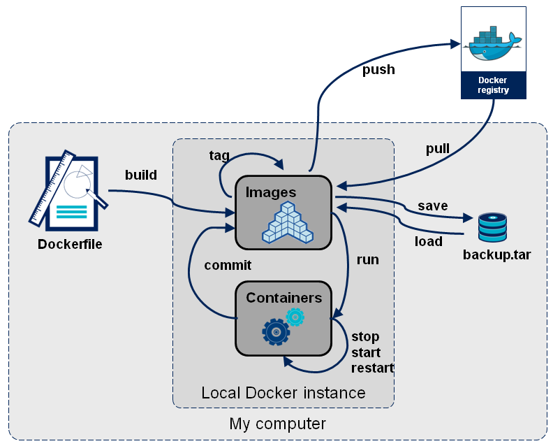
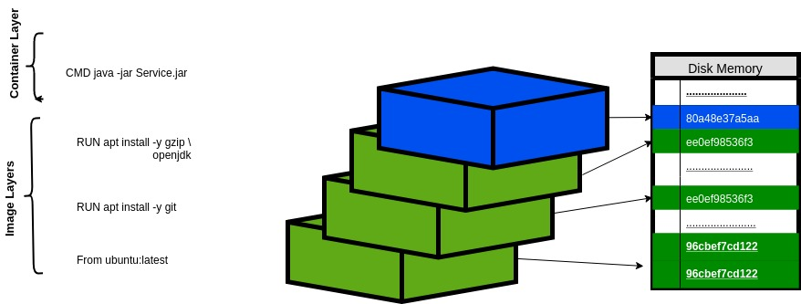
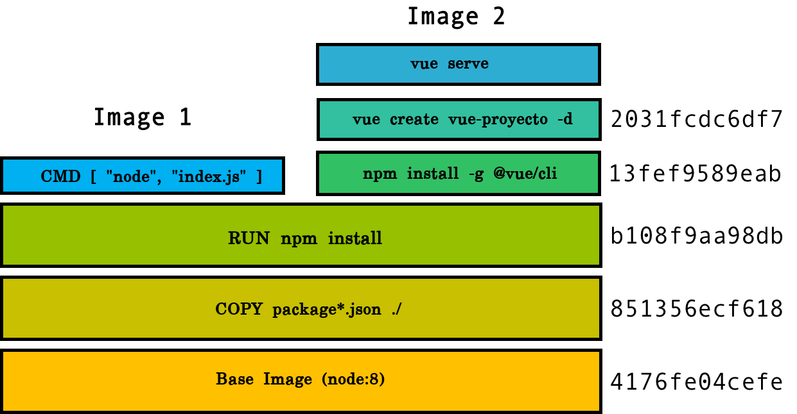
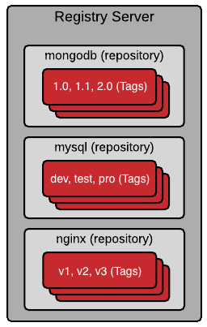

# Learning Docker

Most of the content of this study plan can be learned from here:
[Beginner Level Dockerlabs.](http://dockerlabs.collabnix.com/workshop/docker/)

## What is a Container?
Docker is a tool that let's you package and deploy your applications in any machine that has the Docker Daemon.

You can package anything: Mysql databases, Redis Cache, Java applications, Go applications, DotnetCore applications. You name it.

Let's download a Mysql Docker image with Mysql version 8:
```
docker pull mysql:8
```
Why did I say "Docker image" instead of "Docker container"? Docker images are the artifacts or executables, when they are executed they become "Docker containers".

Go ahead and run a Mysql image to create the container:
```
docker run -d -p 3309:3306 --name mysqltest mysql:8
```
That's it, now you have a Mysql application running in your machine. You can connect to `localhost:3309` with MySQL workbench or any other tool to test it.
You can check the current docker containers running in your machine:
```
docker ps -a
```
Take a look at the logs of the Mysql container:
```
docker logs -f mysqltest
```
Go into the filesystem of your container. This is very similar to SSH or RDP into our container. We're actually going inside our container. Use `exit` to quit.
```
docker exec -it mysqltest bash
```
Check that you're actually in the mysql container by checking the version of the Mysql server running inside of it:
```
mysql version
```
Go back to your machine:
```
exit
```
Go ahead and remove the container:
```
docker rm -f mysqltest
```
It is gone! Why were you able to run MySQL without installing anything related to MySQL? Because all the system dependencies and the application binaries of Mysql were packed in the docker image. Your only dependency is Docker now!

Do you want to get rid of that Mysql Docker image to free up some disk space?
```
docker rmi mysql:8
```

## Difference between Docker Containers and Virtual Machines
Before containers, Virtual Machines were the main tool to run isolated processes inside a server or host. It is important to understand the main differences between these two technologies because each has pros and cons and specific use cases.

*Sources:*

[Azure Documentation on the topic](https://docs.microsoft.com/en-us/virtualization/windowscontainers/about/containers-vs-vm)

[Phoenixap](https://phoenixnap.com/kb/containers-vs-vms)

[Black Blaze](https://www.backblaze.com/blog/vm-vs-containers/)

*Questions you should figure out:*

- What are some advantages of Containers over Virtual Machines?
- What are some advantages of Virtual Machines over Containers?
- Why are containers lighter than Virtual Machines?
- Why are containers faster to start than Virtual Machines?
- Why are Virtual Machines more secure than containers?
- Are containers better than Virtual Machines?

## Why should I use Docker?

Before using any tool because everyone else does, we need to understand it and evaluate if we actually need it. You need to ask yourself "why should I use Docker?"

[InfoWorld Article](https://www.infoworld.com/article/3310941/why-you-should-use-docker-and-containers.html)

[Dockerlabs Perspective](http://dockerlabs.collabnix.com/docker/Docker_VIT_Intro/Docker_VIT_Intro.html)

*Questions you should figure out:*
- What are the benefits of using Docker?
- When should you avoid using Docker?
- What's the relation between Docker and scalability?
- What's the relation between Docker and portability?
- What's the relation between Docker and microservices?

## Lifecycle of Docker
This image describes the Docker lifecycle and all of the "concepts" involved in it. These concepts are broken into 2 categories: Actors and Actions. We'll explore each of these concepts in this guide.

The main actors are:
- Dockerfile
- Docker Image
- Docker Repository and Registry
- Docker Container
- Docker Tag

The main actions related to these actors are:
- docker build
- docker pull
- docker run
- docker push




## The Dockerfile

The Dockerfile is basically a text file that tells Docker how to build an image. It is a set of steps written in shell, like an algorithm, that step by step builds the image.

Follow this guide to understand the Dockerfile a little better:
- [Dockerfile Workshop](https://dockerlabs.collabnix.com/beginners/dockerfile/Writing-dockerfile.html#what-is-a-dockerfile)
- [Static webpage with Nginx](https://www.katacoda.com/courses/docker/create-nginx-static-web-server)

There are two ways in which we usually build images:

1. We can pass the whole project to the Dockerfile and build it inside:
```
FROM node:10
WORKDIR /app
COPY . .
RUN npm install
RUN npm run-script build
ENTRYPOINT ["node", "/app/dist/server.js"]
```

2. Or we can build the project outside of the Dockerfile (maybe in Jenkins or another CI) and pass the artifact using the COPY clause.
```
FROM node:10
WORKDIR /app
COPY node_modules node_modules
COPY dist dist
ENTRYPOINT ["node", "/app/dist/server.js"]
```

*Questions you should figure out:*
- What is a Dockerfile? What is it used for?
- How are docker images created? Which command?
- What is the FROM clause for?
- What is the RUN clause for?
- What is the COPY clause for?
- What is the Docker build context?
- What is the WORKDIR clause for?
- What is the difference between the COMMAND and the ENTRYPOINT clause?

## Docker Images

A Docker Image in reality is a .tar file (kinda like a .zip) that contains all the required dependences to run an application. The dependencies usually are:
- Operating System libraries.
- Application runtimes (like NodeJS, Dotnetcore Runtime or the Java JRE)
- The artifact of the application that will be executed (.jar, dist folder, .dll)

A Docker image is composed of multiple **layers**. [Understanding layers](https://dockerlabs.collabnix.com/beginners/dockerfile/Layering-Dockerfile.html). Each layer adds something to the image. For example, we could have an image with the following layers:



If we have commong layers, something like this could happen:



Container Layer vs Image Layer:


Update Frequency:


*Questions you should figure out:*
- What is an image in your own words?
- What is an image layer?
- Why is it important to optimize our layers?
- Why is it important to have small Docker images?
- How can we achieve smaller Docker images?
- Can different images share layers?
- What is the Docker cache?
- Should I keep in mind the Docker cache when planning my layers?
- What is the difference between the image layers and the container layer of a running container?
- Why is it important that the most frequently updated image layers are as close as possible to the container layer?

## Docker Registry vs Repository vs Tag

As part of how Docker works, images are pushed to some place and later they can be pulled whenever they are going to be used.

There are 3 concepts we need to understand: registry, repository and tag.

1. The registry is the equivalent of an "account" or "server", it can hold many repositories. A common pattern is to have a single registry in the company to hold all the images, or one registry for pre-prod and another one for prod.
2. The repository is the equivalent of an application. If I had an application "mybusinessX" I would create a repository to hold all the images of that application. A repository has multiple tags.
3. A tag is a specific version of the application that's in the repository. For example, "mybusinessX:1.0.0".

To sum up. Registry (has many) Repository (has many) tag.



## What is the Docker Engine?

You have been running commands using `docker` but how does it actually work? In a few words: The `docker` command (CLI) is a client that sends HTTP requests to an API called the `docker-daemon`. The `docker-daemon` then operates the containers and images (run, build, delete,...).

Sources:

[What is the Docker Engine?](https://docs.docker.com/engine/)

[Docker Architecture](https://www.katacoda.com/courses/docker/create-nginx-static-web-server)


*Questions you should figure out:*
- What is the difference between the Docker Client and the Docker Daemon?
- If the docker daemon is an HTTP API, does it mean that there are other clients besides the command-line tool? Things like SDKs?
- If the docker daemon is an HTTP API, does it mean I can call a remote docker-daemon using the client from my machine?

## Persisting Data with Containers

Sometimes we want to run stateful applications inside of Docker, for example, Mysql or SQL Server. The data we store in these applications is usually CRITICAL, it can't be lost because it is the model of our business. But whenever a container dies, all of it's data is completely removed! So how can we ensure this data is persisted between container restarts? Docker has a mechanism for this called Volumes.

A volume is basically mapping (mounting) a folder of your host machine to a folder of the container. So, if the container dies, the data is still in your host machine.

Please Check this interactive tutorial on data persistence:

- [Katacoda Data Persistence](https://www.katacoda.com/courses/docker/persisting-data-using-volumes)

Technical documentation:
- https://docs.docker.com/storage/
for a general overview on docker storage.
- go deeper on volumes : https://docs.docker.com/storage/volumes/ 
- go deeper on bind mounts: https://docs.docker.com/storage/bind-mounts/
it is recommended to follow the examples on both pages.

*Questions you should figure out:*
- What is a volmue?
- What is a bind mount?
- What are the differences between a volume and a mount bind?
- What are some advantages and good use cases for docker volumes and bind mounts? 
- How to create a volume and a bind mount? 
